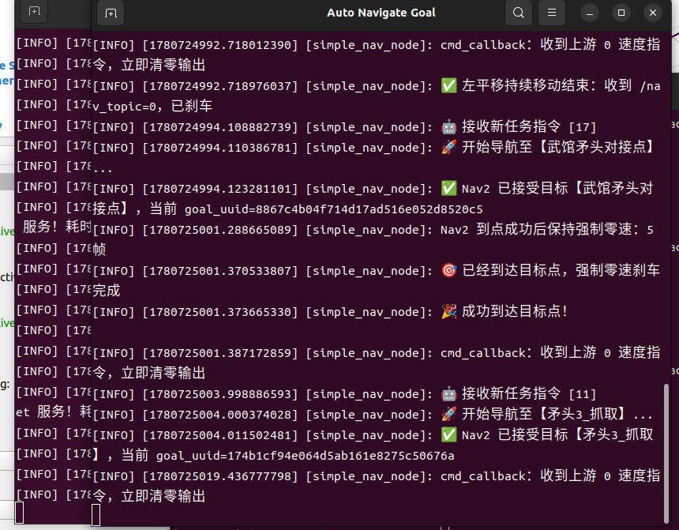

# 进展记录

## 问题

1. 导航有时发送请求后，会直接收到速度清零信息，一动不动

2. 机械臂配合深度摄像头抓取时，有时会偏差比较大。原因估计是摄像头识别角度不太合适，离得比较近导致KFS出现的画面残缺，缺少一部分导致摄像头识别点位时偏离中心点严重。

3. 机械臂部分太复杂僵硬。一是动的太慢，稳定性也差;二是动作有时冗余，前后来拿个很近的点位之间，会有很多其他多余动作。

4. 上坡打滑问题依旧严重。

5. 梅林上的路径规划还是有点蠢，抓取时没有综合考虑出口权重

6. 夹爪recognize状态时，有时车会停止不动，卡在那里。

7. 有些动作可以并行，有些不太需要检测反馈状态，适当处理也可以提速

8. 有些点位导航时误差检测可宽松，实现顺滑，快速定位更优先。

   
